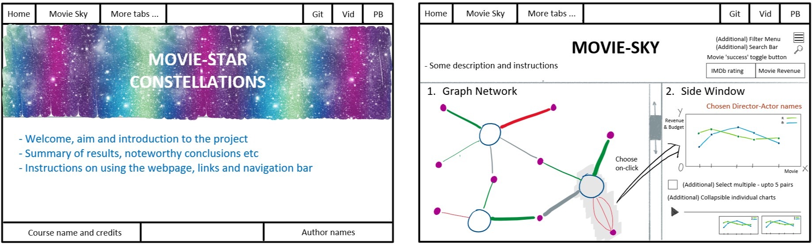
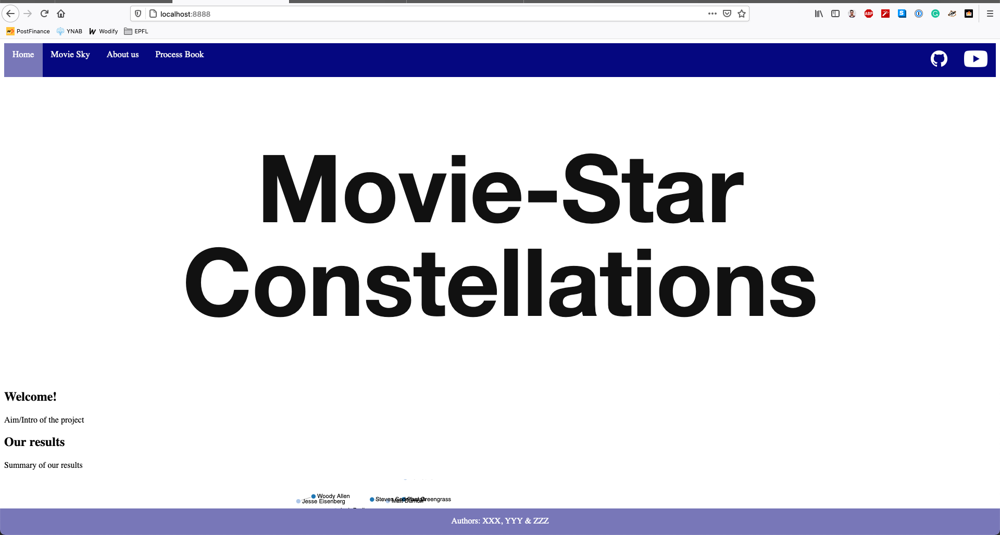
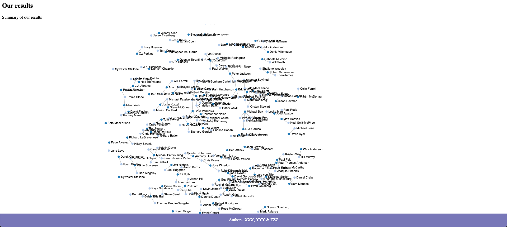

# Project of Data Visualization (COM-480)

| Student's name  | SCIPER |
| ----------------| ------ |
| Kushagra Shah   | 316002 |
| David Dieulivol | 185078 |
| Bruno Schmitt   | 279392 |

[Milestone 1][] • [Milestone 2][] • [Milestone 3][]

## Getting Started

The website is located [here](https://com-480-data-visualization.github.io/data-visualization-project-2021-datavizards).

## Milestone 1 (23rd April, 5pm)

**10% of the final grade**

Visualization about the director-stars success in the top IMDb movies.

### Dataset

> Find a dataset (or multiple) that you will explore. Assess the quality of the data it contains and how much preprocessing / data-cleaning it will require before tackling visualization. We recommend using a standard dataset as this course is not about scraping nor data processing.
>
> Hint: some good pointers for finding quality publicly available datasets ([Google dataset search](https://datasetsearch.research.google.com/), [Kaggle](https://www.kaggle.com/datasets), [OpenSwissData](https://opendata.swiss/en/), [SNAP](https://snap.stanford.edu/data/) and [FiveThirtyEight](https://data.fivethirtyeight.com/)), you could use also the DataSets proposed by the ENAC (see the Announcements section on Zulip).

There is no single unique dataset which aligns perfectly with our project idea. Hence, we are going to use the following three datasets from Kaggle:
1. [IMDB Data from 2006 to 2016](https://www.kaggle.com/PromptCloudHQ/imdb-data): It contains the top 1000 movies on IMDb from 2006 to 2016. It will serve as the primary dataset since it contains relevant data fields such as the director, actors, revenue, rating and metascore for each movie.
2. [IMDB 5000 Movie Dataset](https://www.kaggle.com/carolzhangdc/imdb-5000-movie-dataset): It contains useful information about 5000 movies on IMDb movies upto 2016. It will serve as the secondary dataset as we will extract only the useful fields instead of the complete dataset. It contains additional data fields such as the movie budget and the number of likes (depicting popularity) on the director, actors and movie facebook pages.
3. [The Movies Dataset](https://www.kaggle.com/rounakbanik/the-movies-dataset): It is a humongous dataset which contains metadata for 45000 movies with 43 data fields distributed over 7 files. It will serve as the backup for any missing or conflicting fields in the other two datasets.

The chosen datasets are good-quality credible datasets from Kaggle. They are properly labelled, verified, cleaned, and available for free as CSV files. However, some amount of work is required to combine the primary dataset with useful fields from the secondary dataset:
- Explore and organise the primary dataset as the main source of data
- Add the movie budget and any other fields from the secondary dataset
- Expand the actor field to multiple columns (to match with the secondary dataset)
- Add the number of likes for the movie, director and actor facebook pages
- Filter out any corrupted datapoints which cannot be corrected using the backup dataset

### Problematic

> Frame the general topic of your visualization and the main axis that you want to develop.
> - What am I trying to show with my visualization?
> - Think of an overview for the project, your motivation, and the target audience.

As shown by the [Directors and their Stars webpage][] (Lecture 2), the relationship between an actor and a director might indicate an artistic understanding, a functional routine, or even a marketing strategy. We want to investigate the success of such partnerships by analyzing the results with respect to multiple factors involved in the movie industry. These factors should include the number of movies made together, their budget, revenue and IMDb/audience score. The idea is targetted towards enthusiasts, critics, and students of the movie industry.

The visualization will consist of a webpage with a general overview and our key findings. It will have one graph structure in which the vertices represent actors and directors, and the edges represent their relationship, i.e., if they worked together. A user should be able to click on the edges to investigate the relationship further. On a click, the visualization will focus on the vertices (director and actor) involved and break the edge down into multiples edges, one for each movie done together. It will also show data about the partnership's history: a timeline with the movies and our metrics for success.

### Exploratory Data Analysis

> Pre-processing of the data set you chose
> - Show some basic statistics and get insights about the data

The [preprocessing notebook](notebooks/milestone1_preprocessing.ipynb) shows the basic statistics for the primary dataset. It also highlights some interesting trends about the data, followed by preliminary data cleaning and extraction. Finally, we merge the useful fields from the secondary dataset. Please note that we plan to add additional data from the backup dataset only if our current dataset doesn't suffice for the visualization.

### Related work

> - What others have already done with the data?
> - Why is your approach original?
> - What source of inspiration do you take? Visualizations that you found on other websites or magazines (might be unrelated to your data).
> - In case you are using a dataset that you have already explored in another context (ML or ADA course, semester project...), you are required to share the report of that work to outline the differences with the submission for this class.

We have always been enthusiastic about pop culture, especially movies. Thus finding a dataset related to the entertainment industry was on our radar from the very beginning. We did not find many related works to this specific visualization that is worth mentioning. Most of them consist of a simple plot with the information and lack any objective analysis (For example, one can learn about the highest-rated movie or the one with more considerable revenue, [but][] ... [that's][] ... [about][] ... [it][]).

We used the [Directors and their Stars webpage][] as an inspiration for our proposal. It instigated us to think about the existence of such partnerships. Through our work, we plan to go beyond and take a look into the success of such relationships.

[but]: https://public.tableau.com/profile/milo8469#!/vizhome/Lab2_174/Dashboard1
[that's]: https://www.kaggle.com/unofficialmerve/imdb-exploratory-data-analysis
[about]: https://www.kaggle.com/ambujbhardwaj/imdb-dataset-analysis-report
[it]: https://www.kaggle.com/batuhaneralpofficial/imdb-loves-war

## Milestone 2 (7th May, 5pm)

**10% of the final grade**

The project website will be a single-window application with the main page for welcoming the user. It will contain helpful links, credits, and a description of the project. We will use a navigation bar (and scrolling) to take the user to another page that will contain our data visualization.

### Website Idea - Sketch and Screenshots

The following sketch illustrates our website idea with the welcome page and the visualization:

The following screenshots were taken from the functional prototype in the [website folder](docs):

### Primary Visualization - Graph Network

As described in [Milestone 1][], we aim to study and present the relationship between the directors and actors of various movies. We represent this relationship using a graph in which the vertices represent directors and actors, and the edges represent their relationship, i.e., if they worked together. To be specific, we plan to use a [force-directed-graph](https://github.com/d3/d3-force) with the following design elements:

- Vertices: We will use bigger-sized circles for directors and smaller-sized circles for actors. We will also use two distinct 'neutral' colors (as described in the next point) for the directors and actors for a more straightforward distinction. We will make sure to choose colorblind-friendly color schemes.
- Edges: An edge between a director and an actor indicates that they have worked on at least two movies together. Its thickness will represent the strength of the relationship, i.e., proportional to the number of movies done together. Moreover, the edge color will reflect the relationship's success, i.e., color gradient based on the IMDb score or the movie revenue. The color gradient will move from a 'positive' class to 'neutral' to a 'negative' class.

The page will also contain a toggle button to select the parameter to represent a movie's 'success'. There will be two possibilities: IMDb rating and movie revenue. On toggle, the color of the edges will change accordingly, and it will also change the secondary visualization.

### Secondary Visualization - Side Window

The page will contain a secondary visualization: an on-click side window with information chart(s). The information and interactions contained on this side window are the following:
- On-click: Clicking on edge triggers an event for further inspecting the relationship between a director-actor pair. The clicked edge will expand into multiple edges on the graph: one for each movie done together. The side window will appear with further information.
- Side window: The window will appear on the right side of the webpage, featuring a chart showing the pair's success for each movie. When using revenue as a measure of success, we will also include the movie budget on the chart.
- On-hover: Actors, directors, and movie names only appear on certain hover events to avoid cluttering the visualization. For example, when hovering any non-expanded edge, the name of the director-actor pair should appear.

### Design Goals

After brainstorming sessions and functional prototype design, the final project goals are:
1. The core design will contain the main welcome page and a second page with the previously described two visualizations---the graph and the side window. The minimum viable product will consider only the movie revenue as the 'success' parameter, and hence, there will be no toggle button.
2. We will add these features by the end of the project:
	- Toggle button to choose between the IMDb rating and movie revenue as the movie 'success' parameter.
	- A filter bar on the top of the page should allow selecting, based on a ranking, a subset of director-actor pairs to appear on the graph. For filtering, we will either mask or gray out the removed pairs from the visualization.
	- We have chosen the theme of stars and space, drawing a pun on movie 'stars' and real stars. We will make the website more aesthetically pleasing based on this theme, using background pictures or some dynamic style.
3. We will add these features depending on the relevance and time availability. These are presented below in **no particular order** of preference:
	- We will make the graph cleaner by representing it as a vertically extended, scrollable, and zoomable graph. We will try to rearrange it such that there are minimum overlapping edges for better visibility.
	- We will add extra charts to the side window. These charts should provide more information about the director and the actor while not being restricted to the pair. The user can choose whether or not to display these additional charts.
	- We will add additional filters to display a subset of the graph depending on the available movie metadata: release date, genres, language, country of origin.
	- We will add a search bar to search for a particular director, actor, and/or movie name. If available, the corresponding vertex or edge will be highlighted or zoomed in.
	- We will add a compare option to the side window so that the user can choose from 2 to 5 (upper bound arbitrarily chosen for cleanliness) director-actor pairs to be displayed in the main chart.

### Tools and Lectures Required

Most of the concepts required for the website are elegantly simple and inspiring. Apart from our natural insight and creativity, we plan to use the following tools and lectures:
- [Tool] [D3-force graph](https://github.com/d3/d3-force)
- [Tool] [Jekyll](https://jekyllrb.com)
- [Lectures] Lectures on D3 (Week 4-5)
- [Lectures] Lecture on graphs (Week 11)

### Functional Prototype

Please find the code for the functional prototype in the [website folder](docs). It can be launched by following the [Getting Started instructions](#getting-started) at the top of this README file.

An animation depicting the graph network on the current skeleton version of the website can be found below:

## Milestone 3 (4th June, 5pm)

**80% of the final grade**

We present our final project for the director-actor constellation. Please click the following links to view the submissions:
- The [visualization website](https://com-480-data-visualization.github.io/data-visualization-project-2021-datavizards)
- The [process book](process-book.pdf)
- The [screencast video](https://youtu.be/fyvyC9I-qCU)

## Late policy

- < 24h: 80% of the grade for the milestone
- < 48h: 70% of the grade for the milestone

[Milestone 1]: #milestone-1-23rd-april-5pm
[Milestone 2]: #milestone-2-7th-may-5pm
[Milestone 3]: #milestone-3-4th-june-5pm
[Directors and their Stars webpage]: https://www.nytimes.com/newsgraphics/2013/09/07/director-star-chart/index.html
[atom-live-server package]: https://atom.io/packages/atom-live-server
